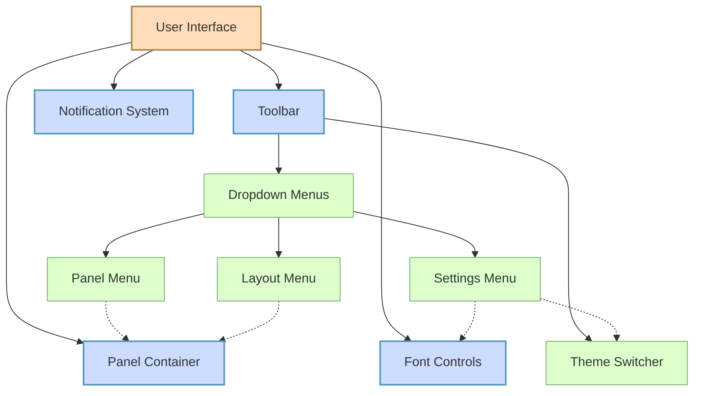

# Cyberpunk GM Screen - Page Connectivity Diagram

## UML Connectivity Diagram

```mermaid
graph TD
    %% Main nodes
    index[index.html]
    app[app.html]
    appModern[app-modern.html]
    appModernFixed[app-modern-fixed.html]
    appModernAccess[app-modern-accessible.html]
    appModernAccessFixed[app-modern-accessible-fixed.html]
    
    %% Development nodes
    debug[debug.html]
    appModernTest[app-modern-test.html]
    appModernUpdated[app-modern-updated.html]
    appModernRefactored[app-modern-refactored.html]
    accessTest[accessibility-test.html]
    
    %% Demo nodes
    cssDemo[css-demo.html]
    themeDemo[theme-demos.html]
    cssIndex[css/index.html]
    cssThemeDemo[css/themes-demo.html]
    
    %% Utility nodes
    error404[404.html]
    
    %% JavaScript nodes
    subgraph JavaScript
        appModernJS[app-modern.js]
        adapterFixedJS[app-modern-adapter-fixed.js]
        panelFixedJS[panel-implementations-fixed.js]
        accessibilityJS[accessibility.js]
        selectorFixesJS[selector-fixes.js]
    end
    
    %% CSS nodes
    subgraph CSS
        stylesCSS[styles.css]
        stylesModernCSS[styles-modern.css]
        stylesEnhancedCSS[styles-enhanced.css]
        variablesCSS[cyberpunk-variables.css]
        typographyCSS[cyberpunk-typography.css]
        neonCSS[cyberpunk-neon-synthwave.css]
        noirCSS[cyberpunk-tech-noir.css]
        resetCSS[cyberpunk-reset.css]
    end
    
    %% Main connectivity
    index --> app
    index --> appModern
    index --> appModernAccessFixed
    
    app --> appModern
    appModern --> appModernFixed
    appModern --> appModernAccess
    appModernFixed --> appModernAccessFixed
    appModernAccess --> appModernAccessFixed
    
    %% JavaScript dependencies
    appModern --> appModernJS
    appModernAccessFixed --> adapterFixedJS
    adapterFixedJS --> panelFixedJS
    appModernAccessFixed --> accessibilityJS
    appModernAccessFixed --> selectorFixesJS
    
    %% CSS dependencies
    app --> stylesCSS
    appModern --> stylesModernCSS
    appModernAccessFixed --> stylesEnhancedCSS
    
    stylesModernCSS --> variablesCSS
    stylesModernCSS --> typographyCSS
    stylesModernCSS --> resetCSS
    
    variablesCSS --> neonCSS
    variablesCSS --> noirCSS
    
    %% Development connections
    appModern --> debug
    appModern --> appModernTest
    appModern --> appModernUpdated
    appModernUpdated --> appModernRefactored
    appModernAccess --> accessTest
    
    %% Demo connections
    index --> cssDemo
    index --> themeDemo
    cssDemo --> cssIndex
    themeDemo --> cssThemeDemo
    
    %% 404 connections
    error404 -.- index
    
    %% Styles
    classDef mainPage fill:#afd,stroke:#4a4,stroke-width:2px
    classDef devPage fill:#fda,stroke:#b84,stroke-width:2px
    classDef demoPage fill:#adf,stroke:#48b,stroke-width:2px
    classDef utilPage fill:#faa,stroke:#b44,stroke-width:2px
    classDef jsFile fill:#ddf,stroke:#77c,stroke-width:1px
    classDef cssFile fill:#ffd,stroke:#cc7,stroke-width:1px
    
    class index,app,appModern,appModernFixed,appModernAccess,appModernAccessFixed mainPage
    class debug,appModernTest,appModernUpdated,appModernRefactored,accessTest devPage
    class cssDemo,themeDemo,cssIndex,cssThemeDemo demoPage
    class error404 utilPage
    class appModernJS,adapterFixedJS,panelFixedJS,accessibilityJS,selectorFixesJS jsFile
    class stylesCSS,stylesModernCSS,stylesEnhancedCSS,variablesCSS,typographyCSS,neonCSS,noirCSS,resetCSS cssFile
```

## Panel System Component Diagram

```mermaid
graph TD
    %% Main panel component
    panelSystem[Panel System]
    
    %% Panel types
    notes[Notes Panel]
    dice[Dice Roller Panel]
    rules[Rules Reference Panel]
    init[Initiative Tracker Panel]
    timer[Game Timer Panel]
    calc[Calculator Panel]
    weapons[Weapons Table Panel]
    armor[Armor Table Panel]
    critical[Critical Injuries Panel]
    netrunning[Netrunning Panel]
    character[Character Sheet Panel]
    npc[NPC Generator Panel]
    loot[Loot Generator Panel]
    map[Night City Map Panel]
    location[Location Generator Panel]
    encounter[Random Encounter Panel]
    
    %% Core functionality
    draggable[Draggable Behavior]
    resizable[Resizable Behavior]
    keyboard[Keyboard Navigation]
    storage[Layout Storage]
    
    %% Panel system connections
    panelSystem --> notes
    panelSystem --> dice
    panelSystem --> rules
    panelSystem --> init
    panelSystem --> timer
    panelSystem --> calc
    panelSystem --> weapons
    panelSystem --> armor
    panelSystem --> critical
    panelSystem --> netrunning
    panelSystem --> character
    panelSystem --> npc
    panelSystem --> loot
    panelSystem --> map
    panelSystem --> location
    panelSystem --> encounter
    
    %% Behaviors
    panelSystem --> draggable
    panelSystem --> resizable
    panelSystem --> keyboard
    panelSystem --> storage
    
    %% Styles
    classDef systemComponent fill:#bcf,stroke:#56a,stroke-width:2px
    classDef panelType fill:#fcd,stroke:#b69,stroke-width:1px
    classDef behavior fill:#cfc,stroke:#5a5,stroke-width:1px
    
    class panelSystem systemComponent
    class notes,dice,rules,init,timer,calc,weapons,armor,critical,netrunning,character,npc,loot,map,location,encounter panelType
    class draggable,resizable,keyboard,storage behavior
```

## User Interface Component Diagram

## Key

- **Solid lines**: Direct navigation links or imports
- **Dotted lines**: Functional relationships
- **Subgraphs**: Group related components
- **Colors**:
  - **Green**: Main application pages
  - **Orange**: Development & testing pages
  - **Blue**: Documentation & demo pages
  - **Red**: Utility pages
  - **Purple**: JavaScript components
  - **Yellow**: CSS components

## Notes

- The main application flow follows: index.html → app versions
- The most complete and accessible version is app-modern-accessible-fixed.html
- Development pages are primarily used for testing new features
- CSS and JavaScript files are organized to support different themes and functionality
- Panel system is the core component with multiple specialized panel types