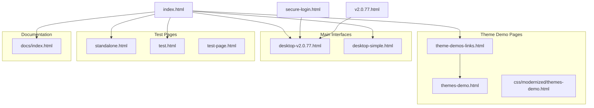
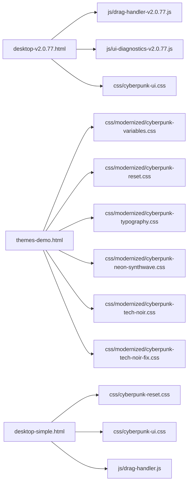
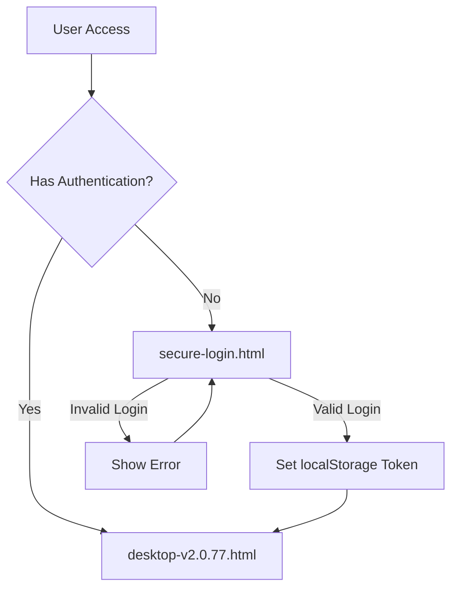
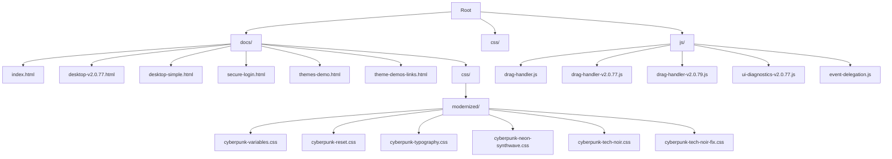

# Visual Site Map - Cyberpunk GM Screen

This document provides a visual representation of the site structure and navigation flows for the Cyberpunk GM Screen project.

## Main Navigation Flow



## Component Dependencies



## Authentication Flow



## File Structure Map



## URL Structure

All URLs on the GitHub Pages site follow this pattern:

```
https://magicat777.github.io/cyberpunk-gm-screen/[path]
```

Where `[path]` is the relative path to the file from the root of the `docs/` directory.

## Common Link Patterns

When creating new pages, always reference this site map and use the appropriate linking pattern:

### Same-Level Links
```html
<a href="other-page.html">Link</a>
```

### Up-Level Links
```html
<a href="../other-page.html">Link</a>
```

### Root-Level Links
```html
<a href="/cyberpunk-gm-screen/page.html">Link</a>
```

### CSS Links
```html
<link rel="stylesheet" href="css/style.css">
<!-- or -->
<link rel="stylesheet" href="../css/style.css">
```

## When Adding New Pages

1. Update both site map documents
2. Update the sitemap.xml file
3. Add appropriate navigation links
4. Test all paths before deploying